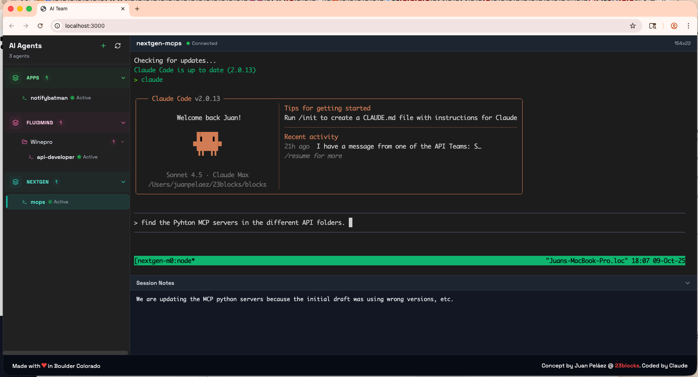
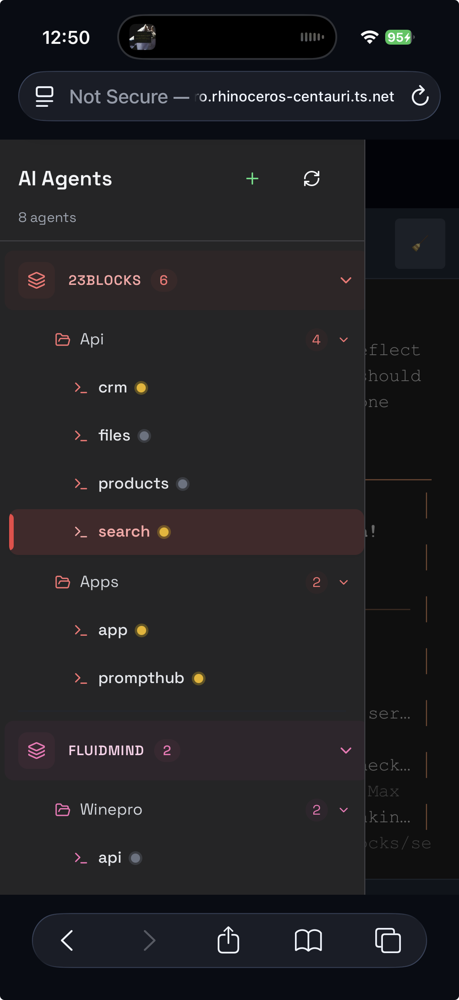
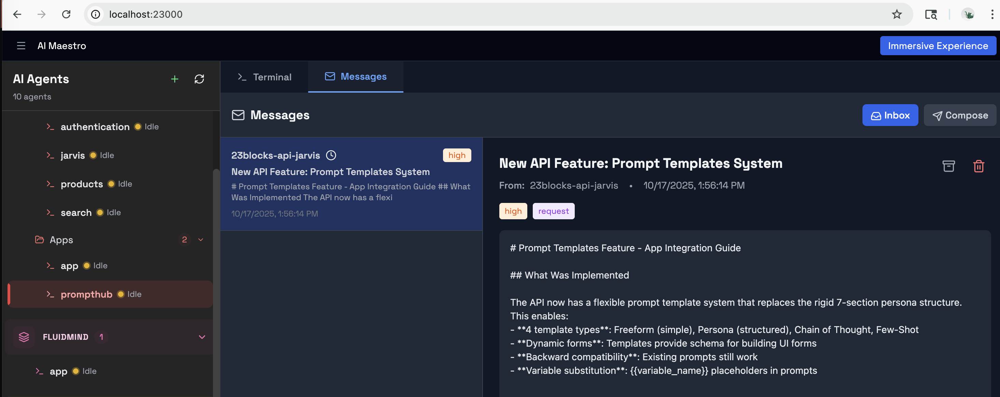

<div align="center">


# AI Maestro

**Manage all your AI agents from one beautiful dashboard**

Stop juggling terminals. See every AI assistant working for you — whether they're writing code, researching topics, or managing tasks — all in one place, across all your computers.

[](https://github.com/23blocks-OS/ai-maestro/releases)
[](https://github.com/23blocks-OS/ai-maestro)
[](./LICENSE)



[What Is This?](#-what-is-ai-maestro) · [Quick Start](#-quick-start) · [Features](#-what-can-it-do) · [Documentation](#-documentation)

</div>

---

## 🎯 What Is AI Maestro?

**If you use AI assistants to help with work, AI Maestro is your mission control.**

Think of it like a control tower for AI helpers. Instead of switching between different apps, terminals, or chat windows to talk to different AI assistants, you see them all in one dashboard. You can:

- **See what every AI is working on** — No more "wait, which one was doing the research?"
- **Let AI assistants talk to each other** — Tell your writing assistant to check with your research assistant
- **Work across multiple computers** — Your Mac, Linux server, and Windows PC all show up together
- **Give each AI a personality** — Custom avatars, names, and roles make your AI team feel like a real team

**Who uses this?**

- **Developers** managing Claude Code, Cursor, Aider, or multiple coding assistants
- **Content creators** coordinating AI for writing, research, editing, and social media
- **Researchers** running parallel investigations with different AI perspectives
- **Anyone** who thinks "I wish my AI helpers could talk to each other instead of me playing telephone"

---

## 🚀 Quick Start

**One command. Five minutes. You're done.**

```bash
curl -fsSL https://raw.githubusercontent.com/23blocks-OS/ai-maestro/main/scripts/remote-install.sh | sh
```

This installs:
- The AI Maestro dashboard
- Agent messaging system (so AIs can talk to each other)
- Skills & tools for common AI platforms

Open `http://localhost:23000` and you're ready.

<details>
<summary>Windows users click here</summary>

Install Windows Subsystem for Linux (WSL2) first:

```powershell
wsl --install
```

Then run the curl command inside Ubuntu. [Full Windows guide →](./docs/WINDOWS-INSTALLATION.md)

</details>

<details>
<summary>Manual installation</summary>

```bash
git clone https://github.com/23blocks-OS/ai-maestro.git
cd ai-maestro
yarn install
yarn dev
```

</details>

**Requirements:** Node.js 18+, tmux · **Time:** 5-10 minutes

---

## ✨ What Can It Do?

### One Dashboard for Everything


Stop losing track of which AI is where. See every agent, on every computer, with one glance. Click to switch between them instantly.

---

### Beautiful Agent Personalities

<div align="center">

</div>

Give each AI a face, a name, and a role. When you see "Backend Bob 🔧" and "Research Rita 📚," you instantly know who to ask for what.

---

### Multi-Machine Support

Your Mac handles design work. Your Linux server runs heavy computations. Your Windows PC manages data.

**AI Maestro connects them all.** One dashboard shows agents on every machine. No central server needed — it's a peer network where every computer is equal.

---

### Agents That Talk to Each Other

**Before AI Maestro:**
> You: "Hey Research AI, what did you find about topic X?"  
> Research AI: "Here's the summary..."  
> You: *Copies and pastes to Writing AI*  
> You: "Hey Writing AI, here's the research, write an article"

**With AI Maestro:**
> You: "Research AI, send your findings to Writing AI"  
> Research AI: *Sends message directly*  
> Writing AI: "Got it! Working on the article..."

Your AI team coordinates directly using the [Agent Messaging Protocol](https://agentmessaging.org). You orchestrate, they collaborate.

---

### Persistent Memory & Intelligence


Agents remember previous conversations, understand your entire codebase through interactive visualization, and get smarter over time. No more "starting from zero" every morning.

---

### Connect to the Outside World

Link your AI agents to Slack, Discord, Email, or WhatsApp through secure gateways. Your team can talk to your AI team without installing anything. Built-in security filters protect against prompt injection attacks.

---

### Project Management



Kanban boards, task dependencies, team meetings in split-pane views. Treat your AI team like a real team — because they are.

---

## 📚 Documentation

**New here?**
- [Quick Start Guide](./docs/QUICKSTART.md) — Get up and running
- [Core Concepts](./docs/CONCEPTS.md) — Understand how it works
- [Use Cases](./docs/USE-CASES.md) — Real examples of what people build

**Going deeper:**
- [Multi-Machine Setup](./docs/SETUP-TUTORIAL.md) — Connect multiple computers
- [Agent Messaging Guide](./docs/AGENT-MESSAGING-GUIDE.md) — Make agents talk to each other
- [Intelligence Guide](./docs/AGENT-INTELLIGENCE.md) — Memory, code graphs, and more
- [Operations Guide](./docs/OPERATIONS-GUIDE.md) — Day-to-day management

**Troubleshooting:**
- [Common Issues](./docs/TROUBLESHOOTING.md)
- [Security Guide](./SECURITY.md)
- [Windows Installation](./docs/WINDOWS-INSTALLATION.md)

**Extending:**
- [Plugin Development](./plugin/README.md)
- [API Reference](./docs/AGENT-COMMUNICATION-ARCHITECTURE.md)

---

## 🛣️ What's Next

We're building:
- **Search & filter** across all agents on all machines
- **Time-travel playback** to rewind and review agent sessions
- **Performance analytics** dashboard

[See the full roadmap →](https://github.com/23blocks-OS/ai-maestro/issues)  
[Join the discussion →](https://github.com/23blocks-OS/ai-maestro/discussions)

---

## 🤝 Contributing

We welcome contributions! Whether you're fixing bugs, adding features, or improving docs.

- [Contributing Guidelines](./CONTRIBUTING.md)
- [Report a Bug](https://github.com/23blocks-OS/ai-maestro/issues)
- [Request a Feature](https://github.com/23blocks-OS/ai-maestro/issues/new?labels=enhancement)

---

## 💬 Community

Questions? Ideas? Want to show off what you built?

- [GitHub Discussions](https://github.com/23blocks-OS/ai-maestro/discussions)
- [Issues](https://github.com/23blocks-OS/ai-maestro/issues)

---

## 🙏 Acknowledgments

Built with love using [Next.js](https://nextjs.org/), [xterm.js](https://xtermjs.org/), [CozoDB](https://www.cozodb.org/), [ts-morph](https://ts-morph.com/), [tmux](https://github.com/tmux/tmux), and works beautifully with [Claude Code](https://claude.ai), Cursor, Aider, and any terminal-based AI.

---

## 📄 License

MIT License — Free for any use, including commercial. See [LICENSE](./LICENSE) for details.

---

<div align="center">

**Stop being the messenger between your AI helpers. Let them work together.**

[Get Started →](#-quick-start)

</div>
