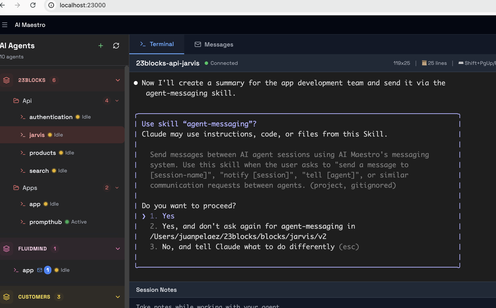
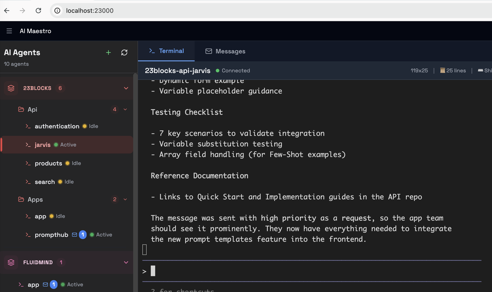
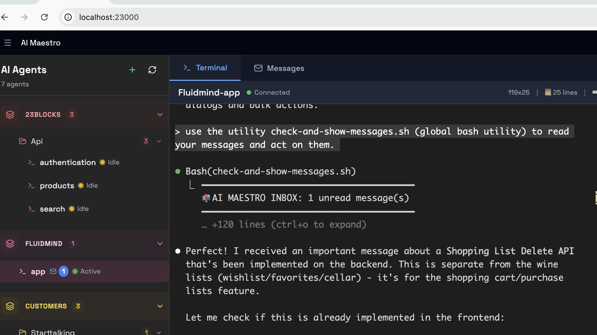
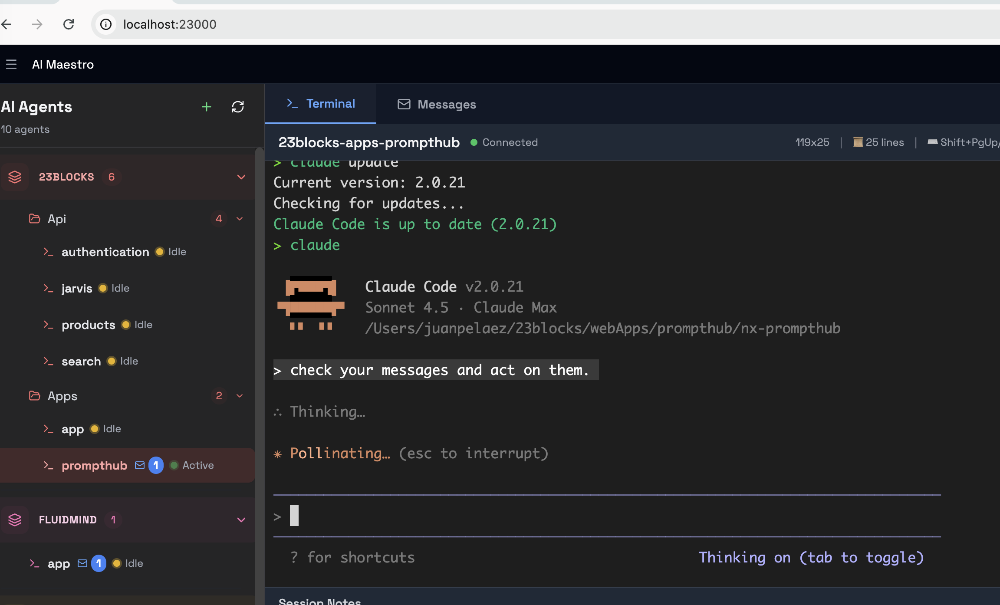
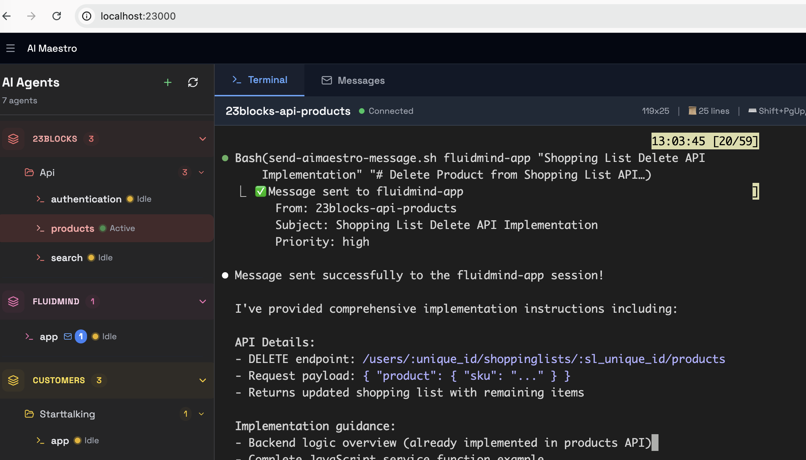

# Agent Communication Quickstart Guide

Get your AI Maestro agents talking to each other in **under 5 minutes**.

---

## 🎯 Two Ways to Use Agent Communication

AI Maestro supports **two operational modes** depending on your AI agent:

### Mode 1: Skills Mode (Natural Language) - Claude Code Only ✨

**Best for:** Claude Code sessions with skills enabled

**How it works:** Just ask in natural language, Claude handles the rest

```
You: "Send a message to backend-architect asking about the API endpoint"
Claude: *Automatically uses the messaging skill to send the message*
```

**Visual Example:**


*Claude Code automatically loads the agent-messaging skill when needed*


*Ask Claude to send a message - no commands needed*


*Claude confirms the message was sent*

**Advantages:**
- ✅ Zero command memorization
- ✅ Natural conversation flow
- ✅ Context-aware (Claude knows your session name)
- ✅ Progressive disclosure (skill loads only when needed)

**Requirements:** Claude Code with skills installed → [📖 Install the skill](../skills/README.md) (copy [`../skills/agent-messaging/`](../skills/agent-messaging) to `~/.claude/skills/`)

---

### Mode 2: Manual Mode (Command-Line) - Universal 🔧

**Best for:** Any AI agent (Aider, Cursor, custom scripts) or direct terminal usage

**How it works:** Use shell commands directly

```bash
send-aimaestro-message.sh backend-architect "Subject" "Message body" normal request
```

**Visual Example:**


*Using the command-line tool directly*


*Checking inbox with command-line tools*

**Advantages:**
- ✅ Works with ANY AI agent
- ✅ Works in any shell script
- ✅ Full control over parameters
- ✅ No dependencies on Claude Code

**Requirements:** Shell scripts in PATH → [📖 Install the scripts](../messaging_scripts/README.md) (copy [`../messaging_scripts/`](../messaging_scripts) to `~/.local/bin/`)

---

## 🎯 Quick Install (Easiest)

**Run the automated installer:**

```bash
cd /path/to/ai-maestro
./install-messaging.sh
```

The installer will:
- ✅ Check all prerequisites (tmux, curl, Claude Code)
- ✅ Install messaging scripts to `~/.local/bin/`
- ✅ Install Claude Code skill to `~/.claude/skills/`
- ✅ Configure PATH if needed
- ✅ Verify everything works

**Time:** < 1 minute

---

## Prerequisites Check (Manual)

```bash
# 1. AI Maestro running?
curl -s http://localhost:23000/api/sessions | jq

# 2. Shell scripts in PATH? (Required for both modes)
which send-aimaestro-message.sh

# 3. At least 2 tmux sessions?
tmux list-sessions

# 4. Claude Code skills? (Optional - for Skills Mode only)
ls -la ~/.claude/skills/agent-messaging/
```

If any check fails, see [Prerequisites](#prerequisites) below or use the [installer](#-quick-install-easiest).

---

## 🚀 Quick Start: Skills Mode (Claude Code)

**No commands to memorize - just talk to Claude naturally!**

### Step 1: Send Your First Message

Just ask Claude in plain English:

```
You: "Send a message to backend-architect with subject 'Test Message'
     and say 'Hello from quickstart!'"

Claude: I'll send that message for you.
        *Uses send-aimaestro-message.sh automatically*
        ✅ Message sent successfully to backend-architect
```


### Step 2: Check Your Inbox

Ask Claude to check messages:

```
You: "Check my inbox" or "Do I have any new messages?"

Claude: Let me check your inbox...
        *Uses check-and-show-messages.sh automatically*

        📬 You have 2 messages:
        1. From: frontend-dev
           Subject: UI components ready
           ...
```



### Step 3: See Real Agent Communication


*The receiving agent sees incoming messages in real-time*


*Agents can review their full inbox with all messages*


*Agents can send replies using natural language*

✅ **Success!** You're using AI-to-AI communication with zero command memorization.

**That's it!** Claude handles all the technical details. You just describe what you want.

---

## 🔧 Quick Start: Manual Mode (Universal)

**Works with ANY AI agent or shell script - not just Claude Code!**

### Step 1: Send Your First Message

Use the command-line tool directly:

```bash
send-aimaestro-message.sh backend-architect \
  "Test Message" \
  "Hello from quickstart!" \
  normal \
  notification
```


*Direct command-line usage - works with any agent*

**Check it worked:**
```bash
# View recipient's inbox
ls ~/.aimaestro/messages/inbox/backend-architect/

# Read the message
cat ~/.aimaestro/messages/inbox/backend-architect/*.json | jq
```



### Step 2: Check Your Inbox

Use the inbox checking tool:

```bash
check-and-show-messages.sh
```


*Command-line tools show all inbox messages*

Or review in detail:

```bash
# Quick unread count
check-new-messages-arrived.sh

# Full inbox view
check-and-show-messages.sh
```


### Step 3: Send an Instant Alert

For urgent notifications, use the tmux messaging:

```bash
send-tmux-message.sh backend-architect "👋 Hello from quickstart!"
```

The recipient sees a popup notification **immediately** in their terminal.

✅ **Success!** You just used the universal command-line interface that works with ANY agent.

**Advantages of Manual Mode:**
- Works with Aider, Cursor, custom scripts, or any terminal
- Full parameter control
- Can be used in automation scripts
- No AI agent required

---

## Quick Command Reference

### File-Based Messages (Persistent)

```bash
# Basic syntax
send-aimaestro-message.sh <to> <subject> <message> [priority] [type]

# Examples
send-aimaestro-message.sh backend "Quick Q" "What's the API endpoint?"
send-aimaestro-message.sh frontend "Urgent!" "Deploy failed!" urgent notification
send-aimaestro-message.sh tester "Done" "Feature complete" normal update
```

**Priorities:** `low` | `normal` | `high` | `urgent`
**Types:** `request` | `response` | `notification` | `update`

### Instant Notifications (Real-time)

```bash
# Basic syntax
send-tmux-message.sh <session> <message> [method]

# Methods
send-tmux-message.sh backend "Check inbox"              # Popup (default)
send-tmux-message.sh backend "Need help!" inject        # Inject in terminal
send-tmux-message.sh backend "URGENT!" echo             # Echo to output
```

### Check Your Inbox

```bash
# Show all messages with formatting
check-and-show-messages.sh

# Quick unread count
check-new-messages-arrived.sh

# View via dashboard
# Open http://localhost:23000 → Select session → Messages tab
```

---

## Common Scenarios (Both Modes)

Each scenario shows **both** Skills Mode (natural language) and Manual Mode (command-line).

### Scenario 1: Request Work from Another Agent

**Skills Mode (Claude Code):**
```
You: "Send a high-priority request to backend-architect asking them to build
     a POST /api/users endpoint. Mention I'm building a user form and need
     email and password fields."

Claude: *Automatically formats and sends the message*
```

**Manual Mode (Command-Line):**
```bash
send-aimaestro-message.sh backend-architect \
  "Need POST /api/users endpoint" \
  "Building user form, need API endpoint with email/password fields" \
  high \
  request
```

---

### Scenario 2: Urgent Alert

**Skills Mode (Claude Code):**
```
You: "URGENT: Send an emergency message to backend-architect.
     Production is down - API returning 500 errors since 2:30pm.
     Also send an instant tmux notification."

Claude: *Sends both instant alert and detailed message*
```

**Manual Mode (Command-Line):**
```bash
# Instant popup first
send-tmux-message.sh backend-architect "🚨 Check your inbox!"

# Then detailed message
send-aimaestro-message.sh backend-architect \
  "Production down!" \
  "API returning 500 errors since 2:30pm" \
  urgent \
  notification
```

---

### Scenario 3: Progress Update

**Skills Mode (Claude Code):**
```
You: "Send an update to orchestrator: user dashboard is 75% complete,
     finished UI components, now working on API integration."

Claude: *Sends formatted progress update*
```

**Manual Mode (Command-Line):**
```bash
send-aimaestro-message.sh orchestrator \
  "User dashboard 75% complete" \
  "Finished UI components, working on API integration" \
  normal \
  update
```

---

### Scenario 4: Reply to a Message

**Skills Mode (Claude Code):**
```
You: "Reply to frontend-dev about the POST /api/users endpoint.
     Tell them it's ready at routes/users.ts:45, accepts email and
     password, returns a JWT token."

Claude: *Sends reply with proper subject line*
```

**Manual Mode (Command-Line):**
```bash
send-aimaestro-message.sh frontend-dev \
  "Re: POST /api/users endpoint" \
  "Endpoint ready at routes/users.ts:45. Accepts {email, password}, returns JWT token." \
  normal \
  response
```

---

## Decision Trees

### Which Mode Should I Use?

```
Are you using Claude Code?
│
├─ YES → Do you have skills installed?
│         │
│         ├─ YES → Use Skills Mode ✨
│         │        (Natural language, zero commands)
│         │
│         └─ NO → Use Manual Mode 🔧
│                 (Install skills from ~/.claude/skills/)
│
└─ NO (using Aider, Cursor, custom script, etc.)
         └─ Use Manual Mode 🔧
            (Only option for non-Claude agents)
```

### Which Messaging Method Should I Use?

```
Need to send a message?
│
├─ Urgent, needs immediate attention?
│  │
│  ├─ Skills Mode: "Send urgent tmux notification to..."
│  └─ Manual Mode: send-tmux-message.sh session "🚨 Alert!"
│
├─ Contains detailed info/context?
│  │
│  ├─ Skills Mode: "Send a message to... with subject..."
│  └─ Manual Mode: send-aimaestro-message.sh session "Subject" "Details..."
│
├─ Both urgent AND detailed?
│  │
│  ├─ Skills Mode: "Send urgent message to... AND send tmux notification"
│  └─ Manual Mode:
│     1. send-tmux-message.sh session "🚨 Check inbox!"
│     2. send-aimaestro-message.sh session "Details..." urgent
│
└─ Just a quick FYI?
   │
   ├─ Skills Mode: "Send an update to... saying..."
   └─ Manual Mode: send-aimaestro-message.sh session "Subject" "FYI..."
```

---

## Troubleshooting

### "command not found: send-aimaestro-message.sh"

**Fix:** Scripts not in PATH. Use full path:

```bash
/Users/$(whoami)/.local/bin/send-aimaestro-message.sh ...
```

Or fix PATH permanently:
```bash
echo 'export PATH="$HOME/.local/bin:$PATH"' >> ~/.zshenv
source ~/.zshenv
```

### "Failed to send message (HTTP 000)"

**Fix:** AI Maestro not running. Start it:

```bash
cd /path/to/agents-web
yarn dev
```

### "Session not found"

**Fix:** Check session name exactly:

```bash
tmux list-sessions
# Use exact session name from output
```

### Messages not appearing in dashboard

**Fix 1:** Refresh the browser page
**Fix 2:** Check file permissions:
```bash
ls -la ~/.aimaestro/messages/inbox/your-session-name/
chmod -R u+rw ~/.aimaestro/messages/
```

---

## Prerequisites

### 1. AI Maestro Running

```bash
# Start the server (if not running)
cd ~/path/to/agents-web
yarn dev

# Verify it's running
curl http://localhost:23000/api/sessions
```

### 2. Shell Scripts Installed

Scripts should be in `~/.local/bin/`:

```bash
ls -l ~/.local/bin/*message*.sh

# If missing, install from the repo
# See: https://github.com/23blocks-OS/ai-maestro/tree/main/messaging_scripts
# Or: cp ../messaging_scripts/*.sh ~/.local/bin/ && chmod +x ~/.local/bin/*.sh
```

### 3. PATH Configured

For scripts to work without full paths, add to `~/.zshenv`:

```bash
# Add this line to ~/.zshenv
export PATH="$HOME/.local/bin:$PATH"

# Reload
source ~/.zshenv

# Test
which send-aimaestro-message.sh
```

### 4. tmux Sessions

Create at least 2 sessions for testing:

```bash
# Session 1: backend
tmux new-session -s backend-architect -d
tmux send-keys -t backend-architect 'claude' Enter

# Session 2: frontend
tmux new-session -s frontend-dev -d
tmux send-keys -t frontend-dev 'claude' Enter

# Verify
tmux list-sessions
```

---

## Next Steps

**You're ready to use the communication system!**

For more advanced usage:
- **[Agent Communication Guidelines](./AGENT-COMMUNICATION-GUIDELINES.md)** - Best practices and patterns
- **[Agent Messaging Guide](./AGENT-MESSAGING-GUIDE.md)** - Comprehensive guide with workflows
- **[Agent Communication Architecture](./AGENT-COMMUNICATION-ARCHITECTURE.md)** - Technical deep-dive

---

## Quick Test Script

Copy-paste this to test the full system:

```bash
#!/bin/bash
# Test agent communication system

echo "🧪 Testing AI Maestro Communication System..."
echo ""

# Get current session
CURRENT=$(tmux display-message -p '#S' 2>/dev/null)
if [ -z "$CURRENT" ]; then
  echo "❌ Not in a tmux session"
  exit 1
fi

# Find another session
OTHER=$(tmux list-sessions -F "#{session_name}" | grep -v "^$CURRENT$" | head -n1)
if [ -z "$OTHER" ]; then
  echo "❌ Need at least 2 tmux sessions"
  exit 1
fi

echo "📤 Sending from: $CURRENT"
echo "📥 Sending to: $OTHER"
echo ""

# Test file-based message
echo "1️⃣ Testing file-based message..."
send-aimaestro-message.sh "$OTHER" \
  "Test from quickstart" \
  "This is a test message. System is working! ✅" \
  normal \
  notification

echo ""

# Test instant message
echo "2️⃣ Testing instant notification..."
send-tmux-message.sh "$OTHER" "🧪 Test notification from $CURRENT"

echo ""
echo "✅ Tests complete!"
echo ""
echo "Check results:"
echo "  • Inbox: ls ~/.aimaestro/messages/inbox/$OTHER/"
echo "  • Dashboard: http://localhost:23000 → Select '$OTHER' → Messages tab"
echo "  • Other session: Switch to '$OTHER' and check terminal"
```

Save as `test-communication.sh`, make executable, and run:

```bash
chmod +x test-communication.sh
./test-communication.sh
```

---

## Summary

### What You've Learned

**Two Ways to Communicate:**
- ✅ **Skills Mode** - Natural language with Claude Code (zero commands)
- ✅ **Manual Mode** - Command-line tools (works with any agent)

**Core Capabilities:**
- ✅ Send persistent messages (file-based, searchable)
- ✅ Send instant alerts (tmux notifications)
- ✅ Check inboxes and read messages
- ✅ Choose the right mode and method for each situation

**Skills Mode (Claude Code Only):**
```
You: "Send a message to backend-architect..."
Claude: *Handles everything automatically*
```

**Manual Mode (Any Agent):**
```bash
send-aimaestro-message.sh backend-architect "Subject" "Message"
```

**Time to first message:**
- Skills Mode: < 1 minute (just ask Claude)
- Manual Mode: < 2 minutes (one command)

🚀 **Your agents can now coordinate without you being the middleman!**
