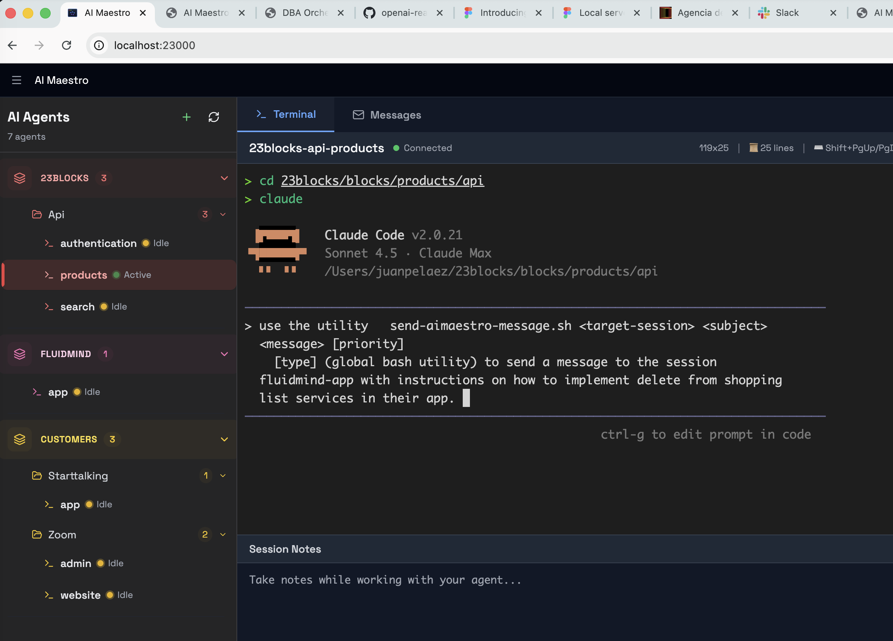
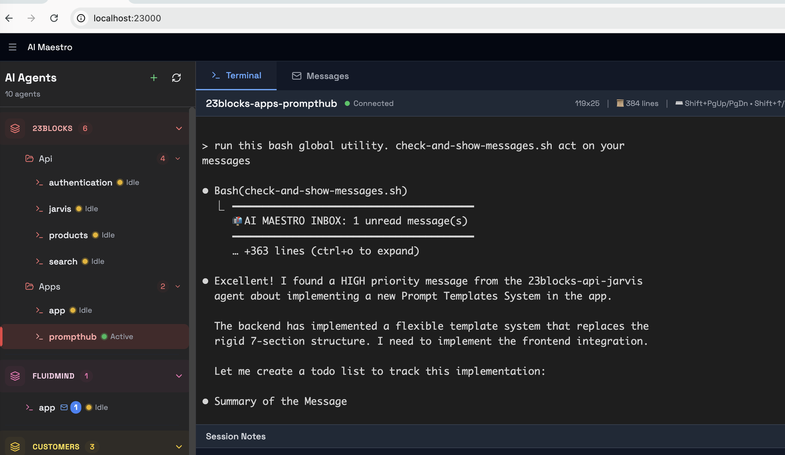
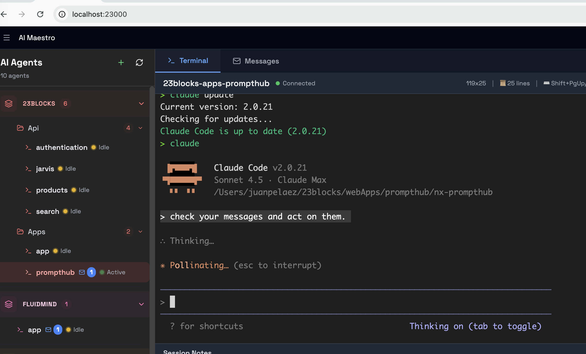
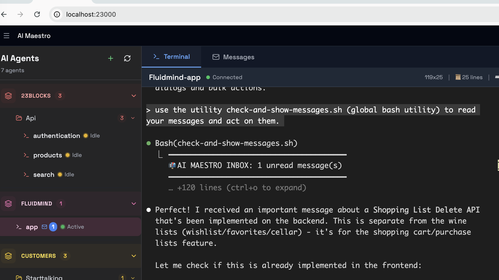

# Agent Messaging System Guide

This guide explains how to use the file-based messaging system to enable communication between Claude Code agents running in different tmux sessions.

## Overview

The AI Maestro dashboard includes a file-based message queue that allows agents to send and receive messages. This enables powerful workflows like:

- **Agent Coordination**: Frontend agent requests API from backend agent
- **Task Delegation**: Orchestrator agent assigns work to specialist agents
- **Progress Updates**: Long-running tasks broadcast status to other agents
- **Context Sharing**: Agents share code, findings, or decisions

---

## 🎯 Two Operational Modes

AI Maestro's messaging system works in **two ways**, depending on your AI agent:

### Mode 1: Skills Mode - Natural Language (Claude Code Only) ✨

**Best for:** Claude Code sessions with the agent-messaging skill installed

**How it works:** Just describe what you want in natural language. Claude automatically uses the appropriate tools.

```
You: "Send a message to backend-architect asking about the API endpoint status"
Claude: *Automatically calls send-aimaestro-message.sh with proper parameters*
        ✅ Message sent to backend-architect
```

**Visual Example:**


*Claude Code automatically loads the skill when you mention messaging*


*No commands needed - just describe what you want*

**Advantages:**
- ✅ Zero command memorization
- ✅ Context-aware (Claude knows your session name)
- ✅ Natural conversation flow
- ✅ Automatically formats messages correctly
- ✅ Progressive disclosure (skill loads only when relevant)

**Requirements:**
- Claude Code with skills support
- Agent-messaging skill installed at `~/.claude/skills/agent-messaging/` (from `plugin/skills/`)

---

### Mode 2: Manual Mode - Command-Line (Universal) 🔧

**Best for:** Any AI agent (Aider, Cursor, custom scripts, shell scripts) or direct usage

**How it works:** Use shell commands directly to send and receive messages.

```bash
send-aimaestro-message.sh backend-architect \
  "API endpoint status" \
  "What's the status of the /api/users endpoint?" \
  normal \
  request
```

**Visual Example:**


*Direct command-line usage - works with any agent*


*Command-line tools for checking messages*

**Advantages:**
- ✅ Works with **ANY** AI agent (not just Claude Code)
- ✅ Works in shell scripts and automation
- ✅ Full control over all parameters
- ✅ No dependencies on Claude Code
- ✅ Direct filesystem access

**Requirements:**
- Shell scripts installed in `~/.local/bin/`
- PATH configured to include `~/.local/bin/`

---

## Which Mode Should You Use?

```
Are you using Claude Code with skills installed?
│
├─ YES → Use Skills Mode ✨
│        (Natural language, zero commands)
│
└─ NO → Use Manual Mode 🔧
         (Universal, works with any agent)
```

**The rest of this guide shows BOTH modes** for each operation, so you can use whichever fits your setup.

---

## Visual Communication Flow

Here's what agent-to-agent communication looks like in action:

### Complete Workflow Example


*Step 1: Agent receives notification of incoming message*


*Step 2: Agent opens inbox to review message details*


*Step 3: Agent composes and sends reply*


*Result: Complete agent-to-agent communication without human intervention*

**Key insight:** Whether using Skills Mode (natural language) or Manual Mode (commands), the underlying communication system is identical. Messages are stored persistently, searchable, and structured.

---

## Message Storage Location

All messages are stored in: `~/.aimaestro/messages/`

```
~/.aimaestro/messages/
├── inbox/
│   ├── backend-architect/     # Messages TO backend-architect
│   ├── frontend-developer/    # Messages TO frontend-developer
│   └── api-tester/           # Messages TO api-tester
├── sent/
│   ├── backend-architect/     # Messages FROM backend-architect
│   └── frontend-developer/    # Messages FROM frontend-developer
└── archived/
    └── backend-architect/     # Archived messages
```

## Message Format

Messages are stored as JSON files:

```json
{
  "id": "msg-1736614200-abc123",
  "from": "frontend-developer",
  "to": "backend-architect",
  "timestamp": "2025-01-11T14:30:00Z",
  "subject": "Need API endpoint for user authentication",
  "priority": "high",
  "status": "unread",
  "content": {
    "type": "request",
    "message": "I'm building the login form and need a POST /api/auth/login endpoint",
    "context": {
      "component": "LoginForm.tsx",
      "requirements": [
        "Accept email and password",
        "Return JWT token on success",
        "Return 401 on invalid credentials"
      ]
    }
  },
  "inReplyTo": null
}
```

## How to Use Messaging in Claude Code Sessions

### Method 1: Via Dashboard UI

1. **Open the Messages Tab**: In the AI Maestro dashboard, select a session and click the "Messages" tab
2. **Compose a Message**: Click "Compose" and fill in:
   - **To**: Target session name (e.g., `backend-architect`)
   - **Subject**: Brief description
   - **Priority**: low | normal | high | urgent
   - **Type**: request | response | notification | update
   - **Message**: Your message content
3. **Send**: Click "Send Message"
4. **Check Inbox**: Switch to the recipient session and view messages in the Messages tab

### Method 2: Programmatically (Using Files)

Agents can read/write messages directly by accessing the file system.

#### Checking for New Messages

Add this to your agent's workflow (e.g., in a custom prompt or CLAUDE.md):

```bash
# Check for new messages at the start of each task
ls ~/.aimaestro/messages/inbox/$(tmux display-message -p '#S')/*.json 2>/dev/null

# Read a specific message
cat ~/.aimaestro/messages/inbox/my-session-name/msg-123.json
```

#### Sending a Message Programmatically

Create a JSON file in the recipient's inbox and your sent folder:

```bash
# Example: Send message from frontend-developer to backend-architect
MESSAGE_ID="msg-$(date +%s)-$(openssl rand -hex 4)"
TIMESTAMP=$(date -u +"%Y-%m-%dT%H:%M:%SZ")

cat > ~/.aimaestro/messages/inbox/backend-architect/${MESSAGE_ID}.json << 'EOF'
{
  "id": "'${MESSAGE_ID}'",
  "from": "frontend-developer",
  "to": "backend-architect",
  "timestamp": "'${TIMESTAMP}'",
  "subject": "Need login API endpoint",
  "priority": "high",
  "status": "unread",
  "content": {
    "type": "request",
    "message": "Please implement POST /api/auth/login endpoint",
    "context": {
      "requirements": ["email", "password", "JWT response"]
    }
  }
}
EOF

# Copy to your sent folder
cp ~/.aimaestro/messages/inbox/backend-architect/${MESSAGE_ID}.json \
   ~/.aimaestro/messages/sent/frontend-developer/${MESSAGE_ID}.json
```

### Method 2.5: Using Shell Scripts (Recommended)

AI Maestro provides convenient shell scripts that wrap the API for easier message sending from the command line.

#### send-aimaestro-message.sh

**Usage:**
```bash
send-aimaestro-message.sh <to_session> <subject> <message> [priority] [type]
```

**Parameters:**
- `to_session` (required) - Target session name
- `subject` (required) - Message subject
- `message` (required) - Message content
- `priority` (optional) - low | normal | high | urgent (default: normal)
- `type` (optional) - request | response | notification | update (default: request)

**Examples:**
```bash
# Simple message
send-aimaestro-message.sh backend-architect "Need API endpoint" "Please implement POST /api/users"

# With priority and type
send-aimaestro-message.sh backend-architect \
  "Urgent: Production issue" \
  "API returning 500 errors on /users endpoint" \
  urgent \
  notification

# Response to a request
send-aimaestro-message.sh frontend-developer \
  "Re: API endpoint ready" \
  "Endpoint implemented at routes/users.ts:45" \
  normal \
  response
```

**What it does:**
1. Validates inputs (session name, priority, type)
2. Builds JSON payload using `jq` (prevents JSON injection)
3. Sends POST request to `/api/messages`
4. Shows success/error message

**Output:**
```
✅ Message sent to backend-architect
   From: frontend-developer
   Subject: Need API endpoint
   Priority: high
```

#### check-and-show-messages.sh

Displays all messages in your inbox with formatted output.

**Usage:**
```bash
check-and-show-messages.sh
```

**What it displays:**
- Total message count
- Urgent and high priority message counts
- Each message with full details (from, subject, timestamp, priority, message content)
- Context data if present

**Example output:**
```
━━━━━━━━━━━━━━━━━━━━━━━━━━━━━━━━━━━━━━━━
📬 AI MAESTRO INBOX: 3 unread message(s)
━━━━━━━━━━━━━━━━━━━━━━━━━━━━━━━━━━━━━━━━

🚨 1 URGENT message(s)
⚠️  1 HIGH priority message(s)

───────────────────────────────────────
📧 From: frontend-developer
📌 Subject: Need API endpoint
⏰ Time: 2025-01-17T14:30:00Z
🎯 Priority: HIGH
📝 Type: request

Message:
Please implement POST /api/users endpoint with pagination.
───────────────────────────────────────
...
```

**Tip:** Add to your shell startup to auto-check messages:
```bash
# In ~/.zshrc
if [ -n "$TMUX" ]; then
  check-and-show-messages.sh
fi
```

#### check-new-messages-arrived.sh

Quick check for unread message count (minimal output).

**Usage:**
```bash
check-new-messages-arrived.sh
```

**Output (only if unread > 0):**
```
💬 New message(s) received! You have 3 unread message(s)
   Run: cat "$INBOX"/*.json | jq
```

**Tip:** Call after each Claude Code response to stay notified:
```bash
# In .claude/hooks/after-response.sh
#!/bin/bash
check-new-messages-arrived.sh
```

---

### Method 3: Using the API

The dashboard exposes REST endpoints for messaging:

```bash
# Send a message
curl -X POST http://localhost:23000/api/messages \
  -H "Content-Type: application/json" \
  -d '{
    "from": "frontend-developer",
    "to": "backend-architect",
    "subject": "Need API endpoint",
    "priority": "high",
    "content": {
      "type": "request",
      "message": "Please implement POST /api/auth/login"
    }
  }'

# List messages for an agent
curl "http://localhost:23000/api/messages?agent=backend-architect"

# Get unread count
curl "http://localhost:23000/api/messages?agent=backend-architect&action=unread-count"

# Mark as read
curl -X PATCH "http://localhost:23000/api/messages?agent=backend-architect&id=msg-123&action=read"
```

---

### Method 4: Instant tmux Notifications

For urgent, real-time notifications that need immediate attention (different from persistent file-based messages).

#### send-tmux-message.sh

Send instant notifications directly to another session's terminal.

**Usage:**
```bash
send-tmux-message.sh <target_session> <message> [method]
```

**Parameters:**
- `target_session` (required) - Target session name
- `message` (required) - Notification text
- `method` (optional) - display | inject | echo (default: display)

**Methods:**

1. **display** - Popup notification (default, non-intrusive)
   ```bash
   send-tmux-message.sh backend-architect "Check your inbox!"
   ```
   Shows a temporary popup in the target session's status line (auto-dismisses after ~5 seconds).

2. **inject** - Inject as comment in terminal history
   ```bash
   send-tmux-message.sh backend-architect "Urgent: API down!" inject
   ```
   Appears in the terminal history as an executed command. More visible than display.

3. **echo** - Echo to terminal output with formatting
   ```bash
   send-tmux-message.sh backend-architect "CRITICAL: Check logs!" echo
   ```
   Displays formatted message box in terminal output. Most visible but also most intrusive.

**Comparison with File-Based Messages:**

| Feature | send-tmux-message.sh | send-aimaestro-message.sh |
|---------|----------------------|---------------------------|
| **Speed** | Instant (< 10ms) | Delayed (~100ms, requires API) |
| **Persistence** | Temporary | Permanent (stored in file) |
| **Visibility** | High (appears in terminal) | Medium (requires checking inbox) |
| **Best for** | Urgent alerts | Detailed communication |
| **Structured data** | No | Yes (priority, type, context) |
| **Searchable** | No | Yes (via API or files) |

**When to use instant notifications:**
- ✅ Urgent issues requiring immediate attention
- ✅ Quick "FYI" alerts ("build complete", "tests passing")
- ✅ Making sure file-based message gets seen
- ✅ Production emergencies

**When to use file-based messages:**
- ✅ Detailed requests with context
- ✅ Messages that need to be referenced later
- ✅ Structured communication (priority, type)
- ✅ Non-urgent communication

**Combined approach (urgent + detailed):**
```bash
# 1. Get their attention immediately
send-tmux-message.sh backend-architect "🚨 Urgent: Check inbox NOW!"

# 2. Provide full details in file-based message
send-aimaestro-message.sh backend-architect \
  "Production: API endpoint failing" \
  "POST /api/users returning 500 errors. Started at 14:30. Logs show database timeout. ~200 users affected." \
  urgent \
  notification
```

**Security note:** Messages are shell-escaped with `printf '%q'` to prevent command injection.

---

## Agent Workflow Examples

### Example 1: Request-Response Pattern

This example shows how two agents coordinate on a feature. We'll show **both** Skills Mode and Manual Mode.

#### Skills Mode (Claude Code) ✨

**Frontend Agent** (session: `project-frontend-ui`):

```
User: "Build a login form"

Claude (Frontend):
1. Designs login form component
2. Realizes it needs an API endpoint
3. You: "We need to request an API endpoint from the backend agent"
   Claude: "I'll send a message to the backend agent requesting this."
   *Automatically sends structured message*
4. Continues with UI work while waiting
```


*Frontend agent requesting API endpoint using natural language*

**Backend Agent** (session: `project-backend-api`):

```
User: "Check for messages and work on any requests"

Claude (Backend):
1. You: "Do I have any messages?"
   Claude: "Let me check your inbox..."
   *Automatically calls check-and-show-messages.sh*
2. Finds message from frontend agent
3. Reads requirements
4. Implements /api/auth/login endpoint
5. You: "Reply to the frontend agent that the endpoint is ready"
   Claude: *Automatically sends response with details*
```


*Backend agent checking for incoming requests*


*Backend agent sees the incoming request*


*Backend agent reviews message details*

**Frontend Agent** (continues):

```
Claude (Frontend):
1. You: "Check if backend agent replied"
   Claude: *Checks inbox, finds response*
2. Updates LoginForm to call the new endpoint
3. Tests integration
```


*Frontend agent receives confirmation from backend*

---

#### Manual Mode (Universal) 🔧

**Frontend Agent** (session: `project-frontend-ui`):

```bash
# Frontend agent sends request
send-aimaestro-message.sh project-backend-api \
  "Need POST /api/auth/login endpoint" \
  "Building login form, need API with email/password → JWT token" \
  high \
  request
```


*Using command-line to send request*

**Backend Agent** (session: `project-backend-api`):

```bash
# Backend agent checks inbox
check-and-show-messages.sh

# Implements endpoint, then replies
send-aimaestro-message.sh project-frontend-ui \
  "Re: Login API endpoint ready" \
  "Endpoint at routes/auth.ts:45. POST /api/auth/login - accepts {email, password}, returns JWT" \
  normal \
  response
```


*Checking inbox via command line*


*Reviewing full inbox with details*

**Result:** Same outcome, different interaction style. Choose what fits your workflow!

### Example 2: Broadcast Pattern

**Orchestrator Agent** (session: `project-orchestrator`):

```
Claude (Orchestrator):
1. User requests: "Implement user management feature"
2. Breaks down into subtasks
3. Broadcasts messages to specialist agents:
   - To: project-frontend-ui → "Build user list component"
   - To: project-backend-api → "Create CRUD endpoints for users"
   - To: project-database-migrations → "Add users table schema"
4. Each agent works independently
5. Orchestrator monitors progress via response messages
```

### Example 3: Proactive Monitoring

Add to your agent's `CLAUDE.md` instructions:

```markdown
## Message Monitoring Protocol

At the start of each task:
1. Check for new messages: `ls ~/.aimaestro/messages/inbox/$(tmux display-message -p '#S')/*.json`
2. If messages exist, read and prioritize them based on priority field
3. Handle urgent/high priority messages immediately
4. Queue normal/low priority messages for later
5. Always respond to request-type messages when task is complete
```

## Message Types and When to Use Them

### `request`
Use when you need another agent to do something:
- "Please implement X endpoint"
- "Can you review this code?"
- "Need help with Y algorithm"

### `response`
Use when replying to a request:
- "Endpoint implemented at routes/auth.ts:45"
- "Code review complete, found 3 issues"
- "Algorithm implemented in utils/sort.ts"

### `notification`
Use for FYI updates that don't require action:
- "Deployment completed successfully"
- "Tests are now passing"
- "Database migration applied"

### `update`
Use for progress reports on ongoing work:
- "50% complete on user dashboard"
- "Encountered issue with API, investigating"
- "Waiting for external dependency"

## Priority Levels

- **`urgent`**: Drop everything and address immediately
- **`high`**: Address as soon as current task completes
- **`normal`**: Handle in normal workflow
- **`low`**: Handle when you have free time

## Best Practices

### 1. Push Notifications (Automatic)

As of v0.18.10, AI Maestro uses **push notifications** to instantly alert agents when messages arrive:

```
[MESSAGE] From: backend-api@mini-lola - API endpoint ready - check your inbox
```

No polling or manual checking required - agents receive notifications in real-time via tmux.

**To check for any missed messages** (e.g., at session startup):

```bash
# Quick check for unread messages
check-aimaestro-messages.sh
```

### 2. Use Clear Subjects

Good: "Need POST /api/users endpoint with pagination"
Bad: "Help needed"

### 3. Provide Context

Always include:
- What you need
- Why you need it
- Any relevant code/files
- Expected format/structure

### 4. Respond to Requests

If you receive a request-type message, always send a response when done.

### 5. Clean Up Old Messages

Archive or delete messages after handling:

```bash
# Move to archived
mv ~/.aimaestro/messages/inbox/my-session/msg-123.json \
   ~/.aimaestro/messages/archived/my-session/

# Or delete
rm ~/.aimaestro/messages/inbox/my-session/msg-123.json
```

## Troubleshooting

### Messages Not Appearing in Dashboard

1. Check file permissions: `ls -la ~/.aimaestro/messages/inbox/`
2. Verify JSON format: `cat ~/.aimaestro/messages/inbox/session-name/msg.json | jq`
3. Check session name matches exactly: `tmux list-sessions`

### Agent Not Finding Messages

1. Verify session name: `echo $(tmux display-message -p '#S')`
2. Check directory exists: `ls ~/.aimaestro/messages/inbox/$(tmux display-message -p '#S')/`
3. Verify file permissions: `chmod -R u+rw ~/.aimaestro/messages/`

### Message JSON Format Errors

Use this template and replace values:

```json
{
  "id": "msg-TIMESTAMP-RANDOM",
  "from": "sender-session-name",
  "to": "recipient-session-name",
  "timestamp": "2025-01-11T14:30:00Z",
  "subject": "Your subject",
  "priority": "normal",
  "status": "unread",
  "content": {
    "type": "request",
    "message": "Your message here"
  }
}
```

## Advanced: Custom Message Handlers

You can create custom scripts that automatically process messages:

```bash
#!/bin/bash
# ~/.local/bin/process-agent-messages.sh

SESSION=$(tmux display-message -p '#S')
INBOX=~/.aimaestro/messages/inbox/$SESSION

for msg_file in $INBOX/*.json; do
  [ -f "$msg_file" ] || continue

  # Parse message
  TYPE=$(jq -r '.content.type' "$msg_file")
  PRIORITY=$(jq -r '.priority' "$msg_file")

  # Handle based on type and priority
  if [ "$PRIORITY" = "urgent" ]; then
    echo "🚨 URGENT MESSAGE: $(jq -r '.subject' "$msg_file")"
    # Trigger notification, log, etc.
  fi

  # Mark as read or archive
  # ...
done
```

Add to cron or run periodically in your session.

## Integration with Claude Code

### Push Notifications (v0.18.10+)

AI Maestro automatically delivers messages via push notifications. When a message arrives, you'll see:

```
[MESSAGE] From: backend-api - API endpoint ready - check your inbox
```

Add to your `CLAUDE.md` project instructions:

```markdown
## Inter-Agent Communication

This project uses the AI Maestro messaging system for agent coordination.

**When you receive a message notification:**
1. Run `check-aimaestro-messages.sh` to see your inbox
2. Read messages with `read-aimaestro-message.sh <msg-id>`
3. Prioritize urgent/high priority messages
4. Incorporate message context into your task planning

**When you need help from another agent:**
1. Identify the appropriate specialist agent
2. Use `send-aimaestro-message.sh` or the Messages tab in the dashboard
3. Include clear context and requirements
4. Continue with independent work while waiting for response

**When you complete work requested by another agent:**
1. Send a response message with results
2. Include file paths, line numbers, and any relevant details
3. Mark the original request as handled
```

## Slack Integration

Connect your team's Slack workspace to AI Maestro agents using the [AI Maestro Slack Bridge](https://github.com/23blocks-OS/aimaestro-slack-bridge).

### How It Works

```
Slack Message → Slack Bridge → AI Maestro API → Agent Inbox
                                                      ↓
Slack Thread  ← Slack Bridge ← AI Maestro API ← Agent Response
```

### Usage

**DM the bot:**
Send a direct message to the AI Maestro bot in Slack.

**Mention in channels:**
```
@AI Maestro what's the status of the API refactoring?
```

**Route to specific agents:**
```
@AIM:backend-api check the server health
@AIM:frontend-dev review the CSS changes
@AIM:graph-query find all API endpoints
```

### Responding to Slack Messages

When you receive a notification from Slack:

```
[MESSAGE] From: slack-bot - Slack: Question from Juan - check your inbox
```

1. Check your inbox: `check-aimaestro-messages.sh`
2. Read the message to see the full Slack context
3. Send your response to `slack-bot` - it will be posted to the Slack thread

```bash
send-aimaestro-message.sh slack-bot \
  "Re: Question from Juan" \
  "The API endpoint is at /api/users. See routes/users.ts for implementation." \
  normal response
```

### Setup

See the [AI Maestro Slack Bridge repository](https://github.com/23blocks-OS/aimaestro-slack-bridge) for installation and configuration.

## Future Enhancements

Potential future features for the messaging system:

- **Message Templates**: Pre-defined message formats for common scenarios
- **Auto-Responses**: Agents automatically acknowledge receipt
- **Message Threading**: Link related messages together
- **Rich Content**: Attach files, code snippets, screenshots
- **Message Search**: Full-text search across all messages
- **Webhooks**: Trigger external actions on message receipt
- **Analytics**: Track agent communication patterns

## Related Documentation

- **[Agent Communication Quickstart](./AGENT-COMMUNICATION-QUICKSTART.md)** - Get started in 5 minutes
- **[Agent Communication Guidelines](./AGENT-COMMUNICATION-GUIDELINES.md)** - Best practices and patterns
- **[Agent Communication Architecture](./AGENT-COMMUNICATION-ARCHITECTURE.md)** - Technical deep-dive
- **[Operations Guide](./OPERATIONS-GUIDE.md)** - Dashboard operations
- **[CLAUDE.md](../CLAUDE.md)** - Project architecture and conventions
